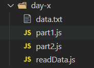
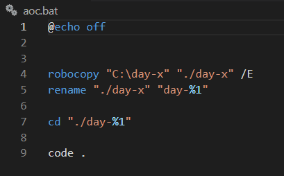
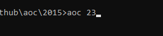

# aoc-template-javascript-windows

## you should use it if you use

- Windows
- Javascript (NodeJs)
- vs code

# Folder
- The data.txt file is where the input data from the challenge goes.
- The readData file reads the input data and exports them as "input" in the js files
- the data you receive is a long string so it would be wise to split it up into an array 
  

# batch file
the batch file copies the folder from your C: directory into your current directory and changes the name to the day you passed. After that it opens the directory in vs code and you are ready to code. 

# Instructions

- copy "day-x" into your C: directory 
- copy "aoc.bat" into your system32 folder 
 (it is located in C:\Windows\System32)

now you are able to execute the batch file when writing "aoc" and the day you want to solve in your command line.

Happy coding